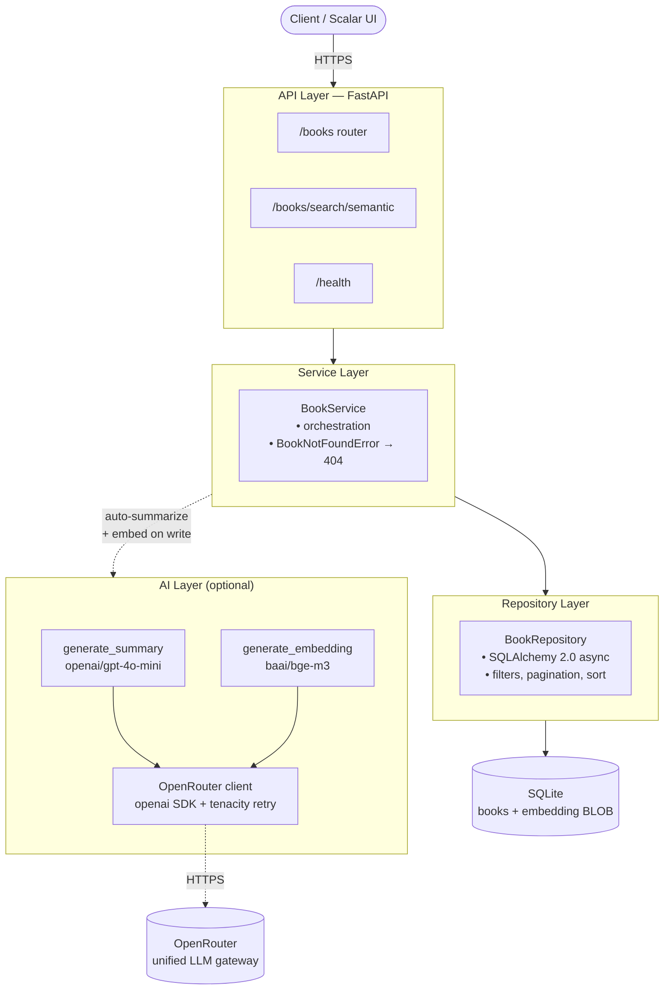

# Virtual Library API

[](https://github.com/heitor-am/virtual-library-api/actions/workflows/ci.yml)
[](https://github.com/heitor-am/virtual-library-api/actions/workflows/deploy.yml)
[](https://github.com/heitor-am/virtual-library-api/releases)


> REST API for a virtual library, with **LLM-generated summaries** and **semantic search via embeddings**. FastAPI + OpenRouter + SQLite on Fly.io.

🚀 **Live demo:** https://virtual-library-api.fly.dev
📚 **Interactive docs (Scalar):** https://virtual-library-api.fly.dev/docs
❤️ **Health:** https://virtual-library-api.fly.dev/health

## ✨ Features

- **Full CRUD** for books with case-insensitive filters, pagination, and sort
- **LLM-generated summary** on create when the client omits one (via OpenRouter, `openai/gpt-4o-mini`)
- **Semantic search** via `baai/bge-m3` embeddings persisted as SQLite BLOBs, scored with vectorized cosine similarity
- **RFC 7807 Problem Details** for every error response (`application/problem+json`)
- **Structured logging** with propagated `request_id`
- **Scalar** interactive docs instead of the default Swagger UI
- **Multi-stage Dockerfile** — ~80 MB runtime image
- **Dev Container** — clone, "Reopen in Container", done
- **5-job CI**: lint, typecheck, tests (≥80% enforced, ~97% actual), Schemathesis contract tests, `pip-audit` + `bandit` security

## 🏗 Architecture



AI is strictly additive — `LLMUnavailableError` and `openai.APIError` on the OpenRouter path are caught in the service, so a downstream LLM outage lets the book persist without a summary or embedding rather than surfacing as a 5xx. See the standalone [architecture diagram](docs/diagrams/architecture.md) and the [request flow](docs/diagrams/request-flow.md) for details.

## 🎯 Try it (live)

Against the deployed URL — no setup needed:

```bash
BASE=https://virtual-library-api.fly.dev

# Create a book — LLM fills in the summary if you omit it
curl -X POST $BASE/books \
  -H 'Content-Type: application/json' \
  -d '{"title": "Dom Casmurro", "author": "Machado de Assis", "published_date": "1899-01-01"}'

# List with case-insensitive filter
curl "$BASE/books?title=casmurro"

# Semantic search — use -G + --data-urlencode for queries with accents
curl -G "$BASE/books/search/semantic" \
  --data-urlencode "q=ciúmes e dúvida" \
  --data-urlencode "top_k=3"
```

Example response from `/books/search/semantic` (truncated — the actual `book` object carries the full `BookRead` schema, including `published_date`, `summary_source`, `created_at`, `updated_at`):

```json
{
  "query": "ciúmes e dúvida",
  "results": [
    {
      "book": {
        "id": 1,
        "title": "Dom Casmurro",
        "author": "Machado de Assis",
        "published_date": "1899-01-01",
        "summary": "\"Dom Casmurro\" é um romance psicológico que narra a vida de Bentinho…",
        "summary_source": "ai",
        "created_at": "2026-04-18T12:41:17",
        "updated_at": "2026-04-18T12:41:17"
      },
      "similarity_score": 0.4097
    }
  ],
  "elapsed_ms": 577.5
}
```

## 🚀 Run locally

### With uv (recommended)

```bash
make install
cp .env.example .env          # then paste your OPENROUTER_API_KEY
make migrate
make seed                     # optional: 18 classic books with AI summaries + embeddings
make dev
```

Open http://localhost:8000 for the landing page or http://localhost:8000/docs for the Scalar reference.

### With Docker

```bash
cp .env.example .env
make docker-up
```

### Dev Container (zero setup)

Open the repo in VS Code → "Reopen in Container" → everything installed, port 8000 forwarded, ready to `make dev`.

## 📡 API

| Method | Path | Description |
|---|---|---|
| `POST` | `/books` | Create a book (auto-summary + embedding when enabled) |
| `GET` | `/books` | List with `?title=`, `?author=`, `?skip=`, `?limit=`, `?sort_by=`, `?order=` |
| `GET` | `/books/{id}` | Get a book by ID |
| `PUT` | `/books/{id}` | Partial update (omit fields to skip them) |
| `DELETE` | `/books/{id}` | Delete a book |
| `GET` | `/books/search/semantic` | `?q=...&top_k=5&min_score=0.0` — cosine similarity over stored embeddings |
| `GET` | `/health` | `status`, `version`, `commit`, `uptime_seconds`, `environment`, `db` |

Full interactive reference at [`/docs`](https://virtual-library-api.fly.dev/docs).

All non-2xx responses use RFC 7807 `application/problem+json`:

```json
{
  "type": "https://virtual-library-api.fly.dev/errors/book-not-found",
  "title": "Book Not Found",
  "status": 404,
  "detail": "Book with id 42 not found",
  "instance": "/books/42",
  "code": "BOOK_NOT_FOUND"
}
```

## 🧪 Development

```bash
make check      # lint + typecheck + tests with coverage
make fmt        # auto-format via ruff
make migration m='describe your change'
make seed
```

CI enforces ≥80% global coverage (`--cov-fail-under=80` in `pyproject.toml`); the codebase currently sits around 97%.

## 📖 Documentation

- [PRD](docs/PRD.md) — scope, architecture, and decisions
- [Diagrams](docs/diagrams/) — architecture + request flow (Mermaid)

### Architecture Decision Records

Short, dated decisions with context, alternatives, and trade-offs.

| # | Decision |
|---|---|
| [001](docs/adr/001-fastapi-over-django.md) | FastAPI over Django/Flask |
| [002](docs/adr/002-uv-package-manager.md) | `uv` as package manager |
| [003](docs/adr/003-fly-io-deployment.md) | Fly.io for deployment |
| [004](docs/adr/004-openrouter-unified-llm-gateway.md) | OpenRouter as unified LLM gateway |
| [005](docs/adr/005-scalar-over-swagger.md) | Scalar over Swagger UI |
| [006](docs/adr/006-rfc-7807-errors.md) | RFC 7807 Problem Details for errors |
| [007](docs/adr/007-bge-m3-for-multilingual-embeddings.md) | `baai/bge-m3` for multilingual embeddings |

## 🛠 Stack

- **Web:** FastAPI 0.115+ · Pydantic v2 · SQLAlchemy 2.0 (async) · Alembic · SQLite
- **AI:** OpenRouter — chat `openai/gpt-4o-mini`, embeddings `baai/bge-m3`
- **Quality:** Ruff · mypy (strict) · pytest (97% cov) · Schemathesis · bandit · pip-audit · pre-commit
- **Infra:** Docker (multi-stage, ~80 MB) · Fly.io · GitHub Actions · Dev Container

## 📝 License

MIT — see [LICENSE](LICENSE).
