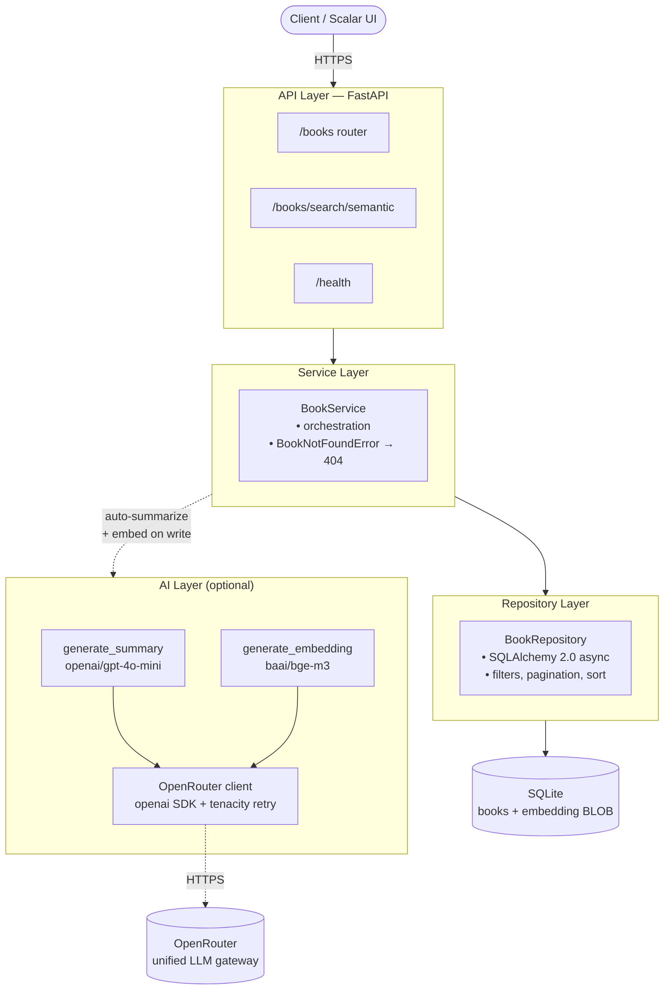

# Architecture

High-level view of the layers and how AI features sit alongside the primary CRUD path.

## Notes

- **AI is additive, not in the critical path.** If OpenRouter is unreachable, the service catches the error and the book is still persisted — just without a summary or embedding. The API contract never degrades to 5xx because of a third-party outage.
- **The repository layer is the only place that touches SQLAlchemy.** Services receive/return ORM objects but never build queries themselves.
- **Dependency injection** (`DbDep`, `BookServiceDep`) wires everything at the router level, which is what makes integration tests easy: the `client` fixture overrides `get_db` and `get_book_service` to hand in in-memory SQLite and a stubbed service.

See also: [request-flow.md](request-flow.md) for the detailed sequence of a `POST /books` call.
