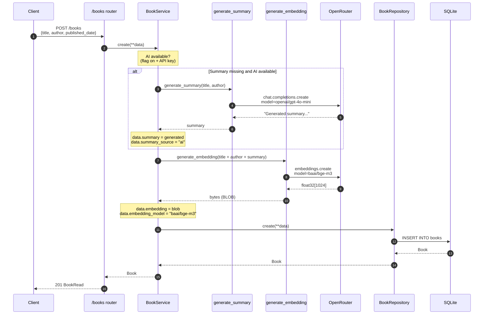

# Request flow — `POST /books` with auto-summarize + embed

Shows the end-to-end path when a client creates a book **without a `summary`**, with AI features enabled. Dashed arrows on the AI path are tolerated failures: the book is saved regardless.

## What happens on failure

- **OpenRouter unreachable / rate-limited** — `APIError` bubbles from the client; the service `try/except` in `_enrich_with_summary` / `_enrich_with_embedding` swallows it, leaves the fields unset, and continues to the repository.
- **Retry** — the OpenRouter client has `tenacity` applied: 3 attempts with exponential backoff (1-10s) on `APIConnectionError`, `APITimeoutError`, `RateLimitError`. Auth and bad-request errors are NOT retried.
- **AI disabled** (`AI_FEATURES_ENABLED=false` or missing key) — both `if` branches skip the AI calls entirely; `POST /books` acts like a plain CRUD write.
